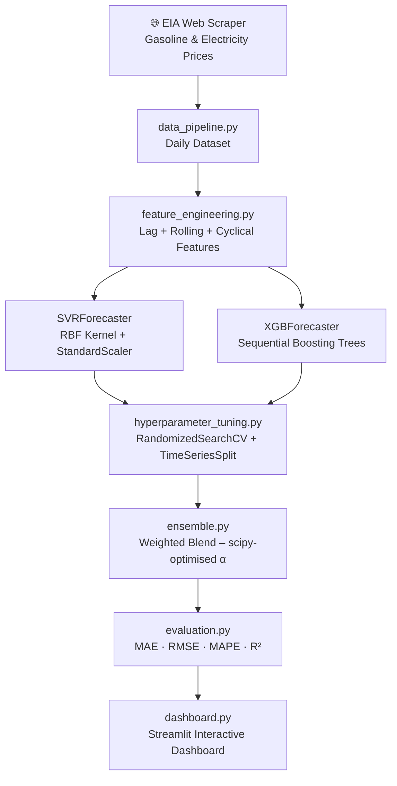

# ⚡ EY – ML Forecasting for EV Market Demand

> **Ernst & Young | Advanced Data Science Internship**  
> XGBoost + SVR Ensemble · Web-scraped EIA Data · Streamlit Dashboard

---

## Overview

This project constructs a **multivariate machine-learning pipeline** to forecast daily Electric Vehicle (EV) charging demand and infrastructure utilisation. Rather than relying on simple univariate historical sales trends, the pipeline ingests **real-world economic and environmental signals** — scraped directly from the **U.S. Energy Information Administration (EIA)** — and derives key features such as gasoline-savings differentials and GHG emission reductions.

The time-series problem is reframed as a **supervised learning task** via sliding-window feature engineering, enabling a powerful ensemble of **Support Vector Regression (SVR)** and **Extreme Gradient Boosting (XGBoost)** to deliver accurate, interpretable forecasts.

---

## Architecture



---

## Pipeline Phases

| Phase | Module | Description |
|-------|--------|-------------|
| **1 – Data Ingestion** | `data_pipeline.py` | Scrapes EIA weekly gasoline prices & monthly electricity prices; derives GHG/CO₂ savings and synthetic EV demand |
| **2 – Feature Engineering** | `feature_engineering.py` | Lag features (t-1…t-30), rolling mean/std (7d, 30d), cyclical day/month/year encodings, price-differential interaction |
| **3 – Model Training** | `models.py` | `SVRForecaster` (RBF kernel + StandardScaler pipeline) and `XGBForecaster` (gradient boosting, L1/L2 regularised) |
| **4 – Hyperparameter Tuning** | `hyperparameter_tuning.py` | `RandomizedSearchCV` with `TimeSeriesSplit` CV; searches C/γ/ε for SVR and LR/depth/subsample for XGBoost |
| **5 – Ensemble** | `ensemble.py` | Scipy Nelder-Mead optimises blend weight α minimising validation MAE |
| **6 – Evaluation** | `evaluation.py` | Out-of-sample MAE, RMSE, MAPE, R² |
| **7 – Dashboard** | `dashboard.py` | Streamlit app with KPI cards, forecast chart, feature importance, residuals |

---

## Data Sources

| Source | Data | URL |
|--------|------|-----|
| **U.S. EIA** | Weekly retail gasoline price ($/gal) | [eia.gov/dnav/pet](https://www.eia.gov/dnav/pet/hist/LeafHandler.ashx?n=PET&s=EMM_EPM0_PTE_NUS_DPG&f=W) |
| **U.S. EIA** | Monthly residential electricity price (¢/kWh) | [eia.gov/electricity/monthly](https://www.eia.gov/electricity/monthly/) |
| **Derived** | GHG savings (kg CO₂/day), fuel savings ($/day), EV demand (sessions/day) | Calculated from above |

---

## Installation & Usage

```bash
# 1. Clone / navigate to project folder
cd "EY Intern"

# 2. Install dependencies
pip install -r requirements.txt

# 3a. Run full pipeline (with hyperparameter tuning)
python main.py

# 3b. Fast run (skip tuning)
python main.py --fast

# 4. Launch Streamlit dashboard
streamlit run dashboard.py
```

> The dashboard requires `artefacts/` to be populated first (run `main.py`).

---

## Feature Engineering Detail

```python
# Lag features – temporal memory for ML models
demand_lag_1, demand_lag_2, demand_lag_3, demand_lag_7, demand_lag_14, demand_lag_30
fuel_savings_lag_1, fuel_savings_lag_3, fuel_savings_lag_7, fuel_savings_lag_14

# Rolling statistics – trend + volatility
demand_roll_mean_7,  demand_roll_std_7
demand_roll_mean_30, demand_roll_std_30
ghg_roll_mean_7,     ghg_roll_mean_30
fuel_savings_roll_mean_7,  fuel_savings_roll_std_7
fuel_savings_roll_mean_30, fuel_savings_roll_std_30

# Cyclical encodings (sin/cos)
dow_sin, dow_cos        # day-of-week
month_sin, month_cos    # month
doy_sin,  doy_cos       # day-of-year

# Economic interaction
price_diff_per_kwh      # gasoline cost - electricity cost (kWh-equivalent)
```

---

## Algorithmic Rationale

### SVR (Support Vector Regression)
SVR uses the **Radial Basis Function (RBF) kernel** to project data into a higher-dimensional space, fitting a robust trend through noisy observations via an ε-insensitive loss tube. SVR excels at the **smooth, long-horizon trend** of EV adoption growth.

### XGBoost
XGBoost builds **sequential decision trees** that iteratively correct residual errors of the prior tree. With L1/L2 regularisation and subsampling, it captures **abrupt non-linear market shocks** driven by the engineered economic and environmental features.

### Weighted Ensemble
The blend weight α (share of SVR) is **numerically optimised via Nelder-Mead** to minimise MAE on a held-out validation fold:

```
ŷ_ensemble = α · ŷ_SVR + (1−α) · ŷ_XGBoost
```

---

## Project Structure

```
EY Intern/
├── data_pipeline.py          # EIA scraping + dataset construction
├── feature_engineering.py    # Tabularisation + feature creation
├── models.py                 # SVRForecaster + XGBForecaster classes
├── hyperparameter_tuning.py  # RandomizedSearchCV wrappers
├── ensemble.py               # WeightedEnsemble with scipy optimisation
├── evaluation.py             # MAE, RMSE, MAPE, R² metrics
├── visualization.py          # Plotly dark-theme charts
├── dashboard.py              # Streamlit interactive dashboard
├── main.py                   # Pipeline orchestration entry point
├── requirements.txt
└── artefacts/                # Generated after running main.py
    ├── raw_dataset.csv
    ├── feature_dataset.csv
    ├── test_predictions.csv
    ├── model_comparison.csv
    ├── svr_model.pkl
    ├── xgb_model.pkl
    ├── ensemble_model.pkl
    └── charts/
        ├── forecast.html
        ├── feature_importance.html
        ├── residuals.html
        ├── model_comparison.html
        └── gasoline_vs_demand.html
```

---

## Academic References

1. **Almaghrebi, A., Aljuheshi, F., Rafaie, M., James, K., & Alahmad, M.** (2020).  
   *Data-Driven Charging Demand Prediction at Public Charging Stations Using Supervised Machine Learning Regression Methods.*  
   Energies, 13(16), 4231. https://doi.org/10.3390/en13164231

2. **Chen, T., & Guestrin, C.** (2016).  
   *XGBoost: A Scalable Tree Boosting System.*  
   Proceedings of KDD '16, 785–794. https://doi.org/10.1145/2939672.2939785

3. **Smola, A. J., & Schölkopf, B.** (2004).  
   *A tutorial on support vector regression.*  
   Statistics and Computing, 14(3), 199–222.

4. **U.S. Energy Information Administration.** (2024).  
   *Weekly U.S. All Grades All Formulations Retail Gasoline Prices.*  
   Retrieved from https://www.eia.gov/petroleum/gasprices/

5. **U.S. Energy Information Administration.** (2024).  
   *Electric Power Monthly – Table 5.6.A: Average Retail Price of Electricity.*  
   Retrieved from https://www.eia.gov/electricity/monthly/

---

*Built as part of the Ernst & Young Advanced Data Science Internship, 2024–25.*
